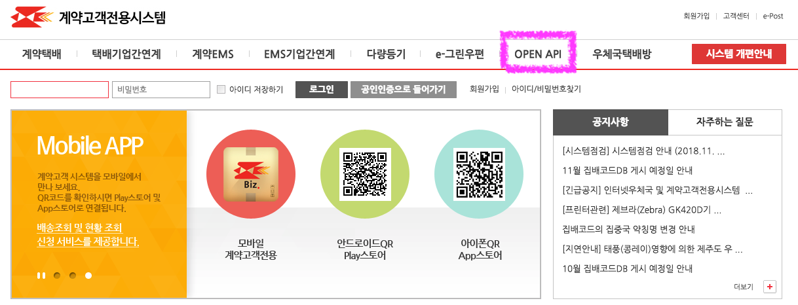
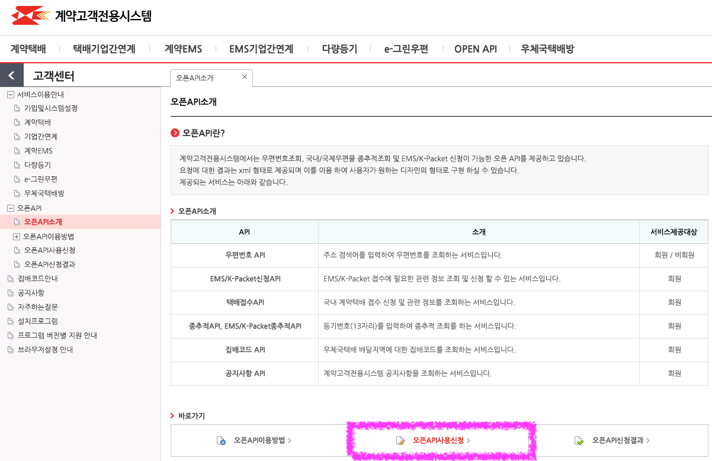
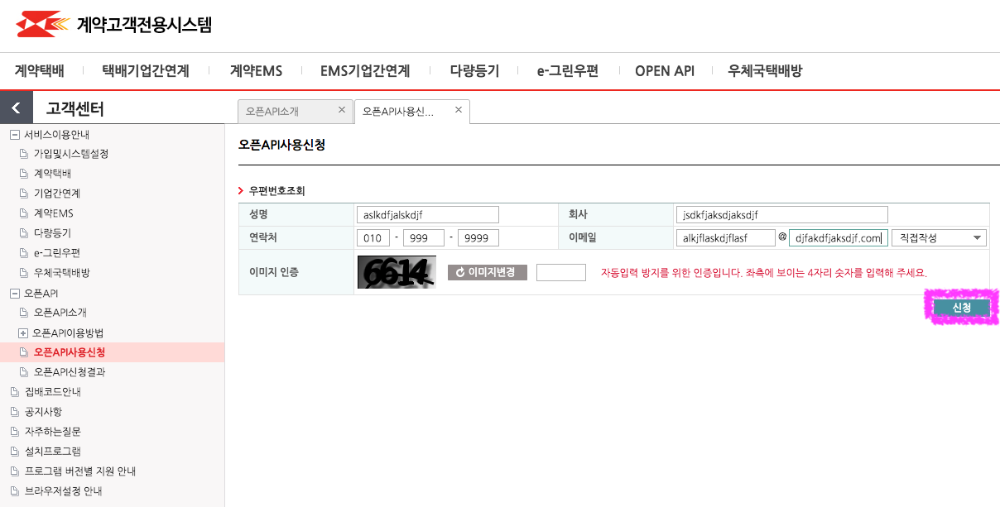
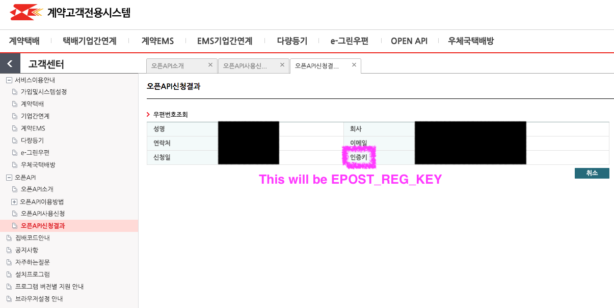

# 우체국 OPEN API Go Wrapper

> This is some example code on how to request and process data from the [우체국 OPEN API](https://biz.epost.go.kr/ui/index.jsp) postal code service.

### Signing up with 우체국







### Equivalent version in Python (for reference)

```python
>>> from urllib.parse import quote
>>> print(quote(u'뒷골2로 47-20'.encode('EUC-KR'), safe=''))
%B5%DE%B0%F12%B7%CE%2047-20
```